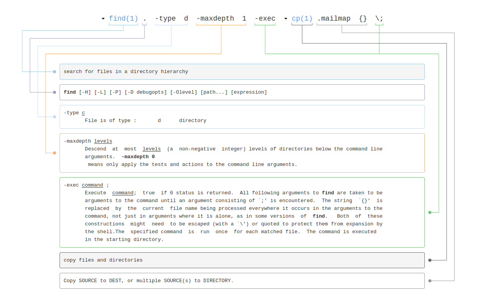

# Creating an organisation-wide gource animation

## Preparations before creating logs

<!-- toc -->

- [Adding a `.mailmap` file](#adding-a-mailmap-file)
  - [Creating a `.mailmap` file](#creating-a-mailmap-file)
  - [Checking the `.mailmap` file](#checking-the-mailmap-file)
  - [Using the `.mailmap` file](#using-the-mailmap-file)

<!-- tocstop -->

### Adding a `.mailmap` file

In most repositories there are commits that, to git, seem to be made by different authors, even though they are the same
person. This happens when there are multiple email addresses or names used for the same person.

To tell git (and thus Gource) who is who, a `.mailmap` file can be added to the root of each repository.

Each line in this file map the name of an author to email address the author _should_ have.

For example, the following line maps the email address `ze-povinho@example.com` to the name "Zé Povinho":

```
Zé Povinho <ze-povinho@example.com>
```

Now, regardless which name is used in the actual commits, the name for this email address will always be the same.

But what if the same person has multiple email addresses?

It is also possible to map an email address to a different name and email address.

For example, the following line maps `another@example.com` to the name "Zé Povinho" and email address "ze-povinho@example.com":

```
Zé Povinho <ze-povinho@example.com> <another@example.com>
```

Now, any commit made with `another@example.com` (regardless of the name used) will be listed as a commit from `Zé Povinho <ze-povinho@example.com>`.

#### Creating a `.mailmap` file

In order to know which email addresses and names to map, we first need to know which email addresses and names there _are_.

For a single repository, this can be done by listing all commits, only showing the email addresses and names: `git log --format='%aN <%aE>'`.
This will give a (possible _very_) long list, with a lot of duplicates. To only see each entry once, the output can be piped to `sort -u`:

```sh
git log --format='%aN <%aE>' | sort -u
```

In order to get all authors from all repositories, a `for` loop can be used, sorting all output and removing duplicates afterwards:

```sh
for sDir in ./repos/*/;do 
    git -C "${sDir}" log --format='%an <%ae>';
done | sort -u
```

If your setup includes directories that are _not_ git repositories, the above command will output errors for those directories.

> fatal: not a git repository (or any of the parent directories)

A check can be added to the loop to make sure `git log` is only called on repositories:

```sh
for sDir in ./repos/*/;do
    if [ $(git -C "${sDir}" rev-parse --is-inside-work-tree 2>/dev/null) ];then
        git -C "${sDir}" log --format='%aN <%aE>';
    fi;
done | sort -u
```

This will output something like:

```
Zé Povinho <ze-povinho@example.com>
ze-povinho <ze-povinho@example.com>
Zé Povinho <another@example.com>
zepovinho <195757@users.noreply.github.com>
potherca <potherca@users.noreply.github.com>
Ben Peachey <potherca@gmail.com>
Ben Peachey <potherca@hotmail.com>
Ben Peachey <Potherca@users.noreply.github.com>
Potherca <potherca@gmail.com>
Potherca <potherca@hotmail.com>
AZ <1234567890@users.noreply.github.com>
```

To create a `.mailmap` file, you will need to decide which name and email address should be used for each author.
Next, map all the _other_ email addresses to the chosen name and email address.

Using the list given above as an example, lets assume we want to use the name "Zé Povinho" with email address `ze-povinho@example.com`,
"Ben Peachey" with `github@pother.ca`, and we don't know (or care) who "AZ" is.

That would give us the following `.mailmap` file (any line starting with a `#` is a comment):

```yml
# ==============================================================================
# The .mailmap feature is used to coalesce together commits by the same person
# in the (short)log, where their name and/or email address was spelled differently.
#
# In the simple form, each line in the file consists of the canonical real name
# of an author, whitespace, and an email address used in the commit (enclosed by
# < and >) to map to the name.
#
#       Proper Name <commit@email.xx>
#
# Other examples:
#
# <proper@email.xx> <commit@email.xx>               # replace only email
# Proper Name <proper@email.xx> <commit@email.xx>   # replace both name and email
# ==============================================================================

# ==============================================================================
# Canonical Email Addresses
#
# These are all contributors to this repository as they SHOULD be listed.
# ------------------------------------------------------------------------------
Zé Povinho      <ze-povinho@example.com>
Ben Peachey     <github@pother.ca>
# ==============================================================================

# ==============================================================================
# Other Email addresses
# ------------------------------------------------------------------------------
Zé Povinho      <ze-povinho@example.com>    <195757@users.noreply.github.com>
Zé Povinho      <ze-povinho@example.com>    <another@example.com>
Ben Peachey     <github@pother.ca>          <potherca@gmail.com>
Ben Peachey     <github@pother.ca>          <potherca@hotmail.com>
Ben Peachey     <github@pother.ca>          <potherca@users.noreply.github.com>
Ben Peachey     <github@pother.ca>          <Potherca@users.noreply.github.com>
# ==============================================================================

# ==============================================================================
# Unknown user
# ------------------------------------------------------------------------------
Unknown         <unknown@example.com>       <1234567890@users.noreply.github.com>
# ==============================================================================

#EOF
```

#### Checking the `.mailmap` file

The mailmap can be validated with `git check-mailmap`. To quote from [the git-check-mailmap manual](https://git-scm.com/docs/git-check-mailmap):

> For each contact, a single line is output, terminated by a newline. If the name is provided or known to the mailmap, “Name <user@host>” is printed; otherwise only “<user@host>” is printed.

However, just feeding the mailmap to git check-mailmap will trigger an error `fatal: unable to parse contact`.

All comments and empty lines need to be filtered for the command to understand the mailmap.
As the list can be quite long, `sort -u` is used to remove duplicates.
  
```sh
cat .mailmap | grep -v '#'| grep '<' | git check-mailmap --stdin | sort -u
```

For the example mailmap given above, this will output:

```
Ben Peachey <github@pother.ca>
Unknown <unknown@example.com>
Zé Povinho <ze-povinho@example.com>
```

If any entry is not as expected, the mailmap needs to be fixed until all is well.

#### Using the `.mailmap` file

Although Gource will _use_ a `.mailmap` file when it is present, there is no `--mailmap` flag to tell `gource` to use a
specific mailmap file. So instead the file needs to be copied into the root of each repository.

For a single repository this would be a simple `cp`:

```sh 
cp .mailmap repos/repo-name/
```

However, to do this for all repositories at once, `find` can be added:

```sh
find ./repos/ -type d -maxdepth 1 -exec cp .mailmap {} \;
```

<details><summary>Explain Shell command</summary>

[](https://explainshell.com/explain?cmd=find+.+-type+d+-maxdepth+1+-exec+cp+.mailmap+%7B%7D+%5C%3B)

</details>
