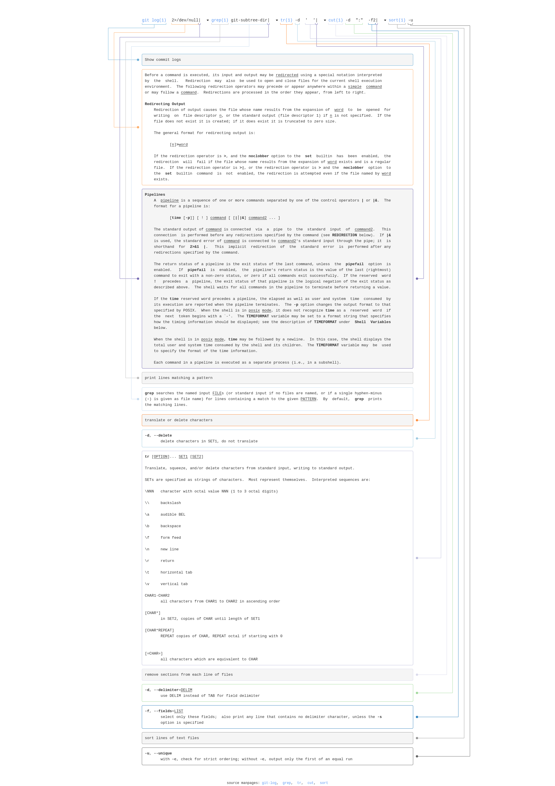
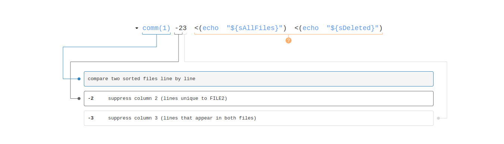

# Creating an organisation-wide gource animation

## Preparations before running gource

<!-- toc -->

- [Cleaning up the log files](#cleaning-up-the-log-files)
  - [Adding a common root](#adding-a-common-root)
  - [Removing submodule / subtree](#removing-submodule--subtree)
  - [Removing third-party code](#removing-third-party-code)
  - [Dealing with deprecated repositories](#dealing-with-deprecated-repositories)

<!-- tocstop -->

When changing a log, rather than editing the original logs output by Gource, the changes are stored in a new file.

This way, long-running operations do not have to be complete. It is also easier, when things aren't to your liking, to just through the new log away and try again. 

In concrete terms,  this means that output from actions are always redirected or piped to a new file, instead of changed in-place.

### Cleaning up the log files

It important to realise that the Gource log file lists paths and the dates on which they were changed, by which author.
These entries are sorted by date.

#### Adding a common root

As we want to make an overview of multiple repositories, we will need to give all the paths the same root.

The simplest way to do this is by using `sed`. 

```sh
sed --regexp-extended "s#(.+)\|#\1|/my-organisation-name#" "logs/full/repository-name.log" > "logs/with-root/repository-name.log"
```

<sup>source: https://github.com/acaudwell/Gource/wiki/Visualizing-Multiple-Repositories</sup>

#### Removing submodule / subtree

If the repository contains git [submodules](https://git-scm.com/docs/gitsubmodules) or [subtrees](https://github.com/git/git/tree/master/contrib/subtree) that are also present as a separate repository, those paths will need to removed form the log.

Git submodules can be listed with:

```sh
git submodule
# or
git submodule--helper list
```

For git subtrees there is no such command. Instead, the subtree paths will need to be grabbed from the git log:

```sh
git log 2> /dev/null | grep git-subtree-dir | tr -d ' ' | cut -d ":" -f2 | sort -u
```

<details><summary>Explain Shell command</summary>



</details>

By redirecting the output of these commands to a file (by appending `>> logs/ignore-paths.txt` to each command), the paths can be used later on.
For instance to remove those paths from a log file, using `grep`:

```sh
grep --file=logs/ignore-paths.txt  --invert-match logs/with-root/repository-name.log > logs/with-paths-ignored/repository-name.log
```

#### Removing third-party code

In some cases, the repository contains third-party code that is not part of the project itself.

Removing this from the log files can be done in the same way as removing submodules / subtrees.

As `grep` accepts mutiple `--file` arguments, the third-party paths to ignore can be placed in their own file.
For instance, if we have a `logs/ignore-vendors.txt` with the following content:

```txt
vendor/
node_modules/
```

They can be removed from the log file at the same time as the submodules / subtrees, by using:

```sh
grep --file=logs/ignore-paths.txt  --file=logs/ignore-vendors.txt  --invert-match logs/with-root/repository-name.log > logs/with-paths-ignored/repository-name.log
```

#### Dealing with deprecated repositories

It is not uncommon for code to be deprecated and removed from the codebase. However, Gource does not compensate for
this. So to make the code disappear from the animation after it has been deprecated, a "delete" entry has to be added for each file in the log file.[^4]

First we do some preparation:

```sh
# Assign the files to a variable to make the command more readable
sSource=logs/with-paths-ignored/repository-name.log
sTarget=logs/clean/repository-name.log

# Use the date of the last entry in the log file, but with a month added to it
sDate="$(tail -n 1 "${sSource}" | cut -d '|' -f 1 | date '+%s' --date='1 month')"

# Create a new log file to work in (as we do not want to alter the original)
cp "${sSource}" "${sTarget}"
```

Now the actual work can be done:

```sh
# List all files in the log file
sAllFiles="$(grep --invert-match '|D|' "${sSource}" | cut -d '|' -f 4 | sort -u)"

# List all entries that are already marked "deleted"
sDeleted="$(grep '|D|' "${sSource}" | cut -d '|' -f 4 | sort -u)"

# Compare the two lists, and only keep the files that are not marked as deleted
sFiles="$(comm -23 <(echo "${sAllFiles}") <(echo "${sDeleted}"))"

# Finally, add a "delete" entry for each file
while read -r sSource; do
    echo "${sDate}|D|${sSource}" >> "${sTarget}"
done <<< "${sFiles}"
```

All of these commands should look familiar, as they have been used in previous sections, except for `comm`.

`comm` is a command that compares two sorted lists, and outputs the differences between them.



These commands _could_ be used inline:

```sh
while read -r sPath; do
    echo "${sDate}|D|${sPath}" >> "${sTarget}"
done <<< "$(
    comm -23 \
        <(
            grep --invert-match '|D|' "${sSource}" \
                | cut -d '|' -f 4 \
                | sort -u
        )
        <(
            grep '|D|' "${sSource}" \
                | cut -d '|' -f 4 \
                | sort -u
        )
    )"
```

But which one is more readable depends on the reader.

After all the logs have been cleaned, all that is left to do is to combine them into a single log file.

[^4]: Or, alternatively, `git rm` will need to be called on the entire repository
