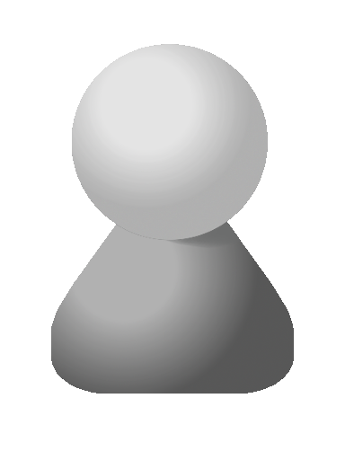

# Creating an organisation-wide gource animation

## Preparations before running gource

### Creating avatars

By default, contributors in the animation are shown as a pawn-like figure:

The pawn is colored based on the contributors name, but it is not very recognizable.

It is possible to use a custom image (or "avatar") to represent contributors in the animation.

All of these avatars need to be place in the same directory.

The file name of an avatar must be the same as the name of contributor it represents. 

As explained earlier, a `.mailmap` file can be used to fix naming issues.

It is also possible to add a `default.png` or `default.jpg` file to represent contributors than don't have their own avatar.

Avatars for Gource must be in the PNG or JPEG format.

If avatars should be a different shape than rectangular (i.e. the full size of the image), an PNG with a transparent background must be used.

If the source images for th avatars are not PNG (or JPEG) they will need to be converted.
This is a topic unto itself, so we will not go into detail here.

Once the avatars are in place, they can be used by Gource by adding the `--user-image-dir` option.

If the avatars in the animation seem to be the wrong size, the `--user-scale` option can be used to scale them up or down.
