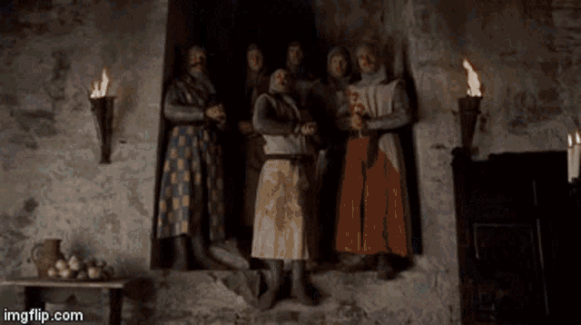

# Creating an organisation-wide gource animation

## Preparations before running gource

<!-- toc -->

- [Creating a Gource caption file](#creating-a-gource-caption-file)
  - [The caption file format](#the-caption-file-format)
  - [Generating a caption file](#generating-a-caption-file)
  - [Manually adding entries to the caption file](#manually-adding-entries-to-the-caption-file)

<!-- tocstop -->

## Creating a Gource caption file

It is possible to add captions to the animation, based on timestamp.

### The caption file format

The format of the caption file is:

```txt
<timestamp>|<caption>
```

Where :
- `<timestamp>` is an ISO 8601 or A unix timestamp of when to display the caption.
- `<caption>` is the caption to display.

Gource can be told which file to use with the `--caption-file` option.

For our example we will be using `captions.txt` in the root of the project.

### Generating a caption file

Let's say, for example, we want to display a caption for each month, we could use the following command:

```sh
for i in 1 2 3 4 5 6 7 8 9 10 11 12;
    do date -d "2022-$i-01" '+%s|%Y %B' >> caption.txt;
done
```

This will create a captions file that look like this:

```
1641596400|2022 January
1644274800|2022 February
1646694000|2022 March
1649368800|2022 April
1651960800|2022 May
1654639200|2022 June
1657231200|2022 July
1659909600|2022 August
1662588000|2022 September
1665180000|2022 October
1667862000|2022 November
1670454000|2022 December
```

For the dates to be displayed in a different language, `LC_TIME` can be set to a different locale. (To see which locales are available, run: `locale -a`).

As most project span more than one year, something a bit more sophisticated might be needed...

The start and end date of the project could be taken from the clean log files, and then the captions file could be generated from that.

```sh
sLogFile=logs/combined.log

iDate="$(head -n1 "${sLogFile}" | cut -d'|' -f1)"
iEnd="$(tail -n1 "${sLogFile}" | cut -d'|' -f1)"

while [ "${iDate}" -lt "${iEnd}" ]; do
    echo "${iDate}|$(LC_TIME='en_GB.utf8' date --date "@${iDate}" '+%Y %B')"
    iDate="$(date --date "$(date --date "@${iDate}" '+%F') + 1 month" '+%s')"
done
```

This will generate all the months between the start and end date of the project.

For instance, using the [`git` repository](https://github.com/git/git) as an example, the caption file will look something like this:

```
1112911993|2005 April
1115503200|2005 May
1118181600|2005 June
1120773600|2005 July
1123452000|2005 August
...
1659909600|2022 August
1662588000|2022 September
1665180000|2022 October
1667862000|2022 November
1670454000|2022 December
```

Something similar could be done by setting Gource's `--date-format` option to `%Y-%m`.

But although there _are_ options to change the font size (and color) for file-, folder-, and user-names, there is no such option for the date. 

Something else to remember is that, where the date is displayed permanently, the caption can be displayed for a limited time, by setting Gource's `--caption-duration` option.

### Manually adding entries to the caption file

Besides the date, there are other things that might be useful to add to the captions.

Such as sprint names (or numbers), releases, or whichever project was worked on at the time. 

As long as your entry has the correct timestamp, it will be displayed at the correct time.

For instance for the New Year:
  
```txt
1672527600|Happy new year!
```

But why stop there?

You could add the number of commits, the number of files, the number of lines added and removed, etc.

Or the name of the contributor with "most commits" or "most files changed", or other gamification elements.

Although... on second thought...


